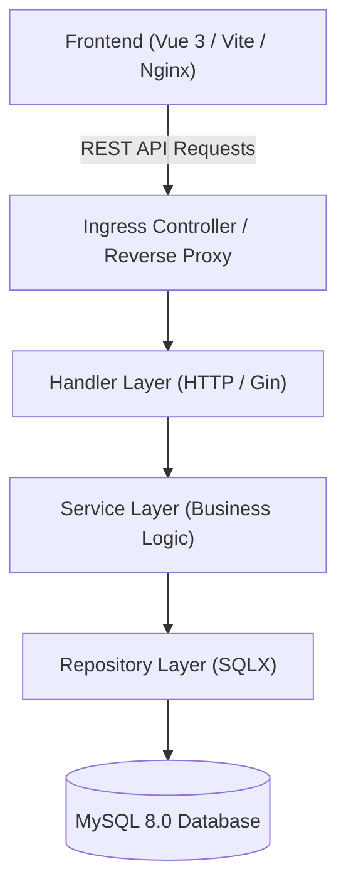

# E-RequestControl — Electronic Request Management System

A full-stack multi-container web application designed for electronic request submission, lifecycle tracking, and administrative governance.

[](https://golang.org)
[](https://vuejs.org)
[](https://www.mysql.com)
[](https://www.docker.com)
[](https://kubernetes.io)
[](LICENSE)

---

## 🚀 Key Features

### For Users
- **Authentication & Security:** JWT token-based authentication with bcrypt password hashing and role-based access control.
- **Ticket Management (CRUD):** Create, view, update, and delete support requests/tickets with ownership validation.
- **Notification Engine:** Event-driven notifications updating users on ticket progression with mark-as-read functionality.
- **Multilingual Support:** Dynamic language switching (Ukrainian and English).

### For Administrators
- **Admin Dashboard:** Overview and management of all system requests with advanced filtering (by sender, assignee, status).
- **User Management:** Full CRUD operations on user accounts and role assignments.
- **Data Management:** Export and import system data (Excel `.xlsx`), database backup generation (`.sql`), and restore operations.

---

## 🏗️ System Architecture

The application is built using a clean three-tier architecture ensuring separation of concerns:



1. **Handler Layer (`pkg/handlers`):** HTTP routing, input binding, request validation, and status code formatting.
2. **Service Layer (`pkg/services`):** Business logic, JWT generation and verification, password hashing with bcrypt.
3. **Repository Layer (`pkg/repository`):** Database queries using `sqlx`, parameterized queries, transactions, and data mapping.

---

## 🛠️ Tech Stack

- **Backend:** Go 1.22+, Gin Web Framework, SQLX, MySQL Driver, Logrus
- **Frontend:** Vue 3 (Composition API & Pinia), Vite, Vue Router, Vue I18n, Axios, Vue Toastification
- **Database:** MySQL 8.0 with InnoDB engine
- **Infrastructure & DevOps:**
  - Docker & Docker Compose
  - Multi-stage Dockerfiles (Go Alpine build + Nginx Alpine static server)
  - Kubernetes Helm Charts (`req-helm`) for Amazon EKS deployment
  - GitHub Actions CI/CD pipeline (Testing, ECR Push, EKS Helm deployment)
  - Monitoring stack: Prometheus, Grafana, Loki

---

## ⚡ Quick Start (Local Development)

### Prerequisites
- [Docker](https://www.docker.com/) and [Docker Compose](https://docs.docker.com/compose/) installed
- Git

### 1. Clone the repository
```bash
git clone https://github.com/hel7/E-RequestControl.git
cd E-RequestControl
```

### 2. Configure Environment Variables
Copy the sample environment file and set your secure secrets:
```bash
cp .env.example .env
```

### 3. Launch with Docker Compose
```bash
docker compose up --build -d
```

### 4. Access the Services
- **Frontend UI:** [http://localhost:5173](http://localhost:5173)
- **Backend API:** [http://localhost:8000/api](http://localhost:8000/api)
- **MySQL Database:** `localhost:3308` (mapped to internal `:3306`)

---

## 📡 API Overview

| Method | Endpoint | Description | Access |
|---|---|---|---|
| `POST` | `/api/auth/register` | Register a new user | Public |
| `POST` | `/api/auth/login` | Authenticate user & get JWT token | Public |
| `POST` | `/api/auth/logout` | Invalidate session | Authenticated |
| `GET` | `/api/tickets/` | Get current user's tickets | Authenticated |
| `POST` | `/api/tickets/` | Create a new ticket | Authenticated |
| `PUT` | `/api/tickets/:ticketID` | Update user's ticket | Owner Only |
| `DELETE` | `/api/tickets/:ticketID` | Delete user's ticket | Owner Only |
| `GET` | `/api/notifications/` | Get user notifications | Authenticated |
| `DELETE` | `/api/notifications/:id` | Mark notification as read | Owner Only |
| `GET` | `/api/admin/tickets/` | Get all tickets with filters | Admin Only |
| `GET` | `/api/admin/users/` | List all users | Admin Only |
| `POST` | `/api/admin/users/` | Create a user account | Admin Only |
| `POST` | `/api/admin/data/backup` | Download database SQL backup | Admin Only |
| `POST` | `/api/admin/data/restore` | Restore database from SQL dump | Admin Only |
| `GET` | `/api/admin/data/export` | Export data to Excel (`.xlsx`) | Admin Only |
| `POST` | `/api/admin/data/import` | Import data from Excel (`.xlsx`) | Admin Only |

---

## 🧪 Quality Assurance & Testing

A comprehensive manual and automated testing suite was conducted across the API endpoints. Detailed test cases, boundary testing, access control verifications, and resolved bug reports are documented in the QA section:

👉 **[View QA Testing Report & Bug Reports](QA/README.md)**

---

## 📄 License

This project is licensed under the MIT License - see the [LICENSE](LICENSE) file for details.
