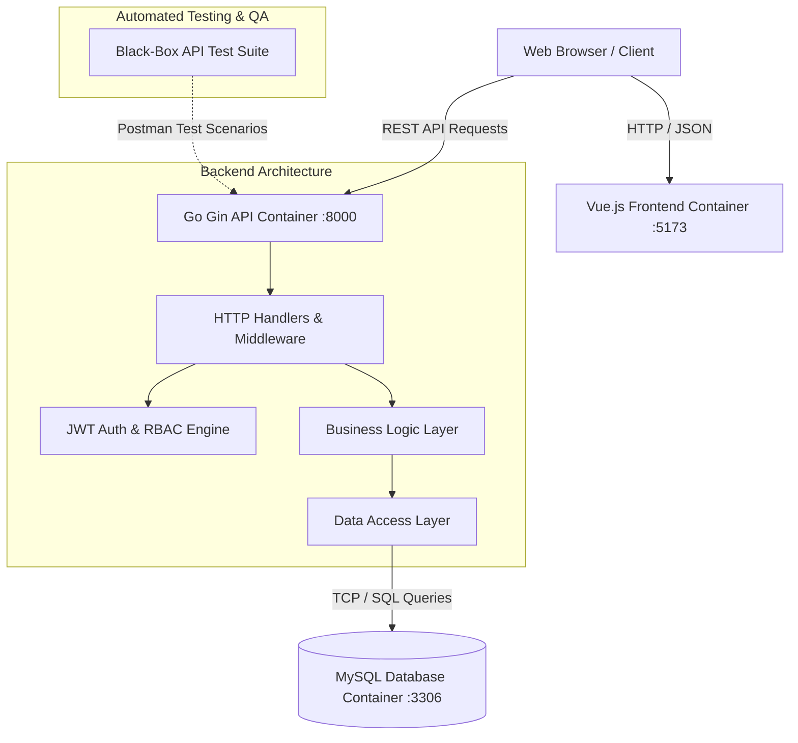

# E-RequestControl — Electronic Request Management System

A full-stack multi-container web application designed for electronic request submission, lifecycle tracking, and administrative governance.

[](https://golang.org/)
[](https://vuejs.org/)
[](https://www.mysql.com/)
[](https://www.docker.com/)
[](https://en.wikipedia.org/wiki/REST)

---

## 🏗 System Architecture

The application is built using a decoupled client-server architecture with a three-tier Go backend (Handler → Service → Repository), ensuring strict Separation of Concerns (SoC).



---

## 🛠 Core Modules & Features

- **Authentication & RBAC:** JWT token-based authentication with role verification (User vs Administrator access).
- **Request Lifecycle Management:** Full CRUD operations for electronic submissions with structured state transitions.
- **Notification Engine:** Event-driven notification delivery updating users on ticket progression.
- **Administrative Control:** User account management, database backup generation, and export capabilities.
- **Containerized Networking:** Fully isolated local bridge network with internal DNS service discovery between services.

---

## 🚀 Quick Start (Local Deployment)

### Prerequisites
- Docker Engine & Docker Compose installed.

### Execution
1. Clone the repository:
   ```bash
   git clone https://github.com/hel7/E-RequestControl.git
   cd E-RequestControl
   ```

2. Start the multi-container environment:
   ```bash
   docker compose up -d --build
   ```

3. Access endpoints:
   - **Frontend UI:** `http://localhost:5173`
   - **Backend API:** `http://localhost:8000/api`
   - **Database Port:** `localhost:3308` (mapped to internal `:3306`)

---

## 🧪 Quality Assurance & Security Validation

The API underwent black-box validation covering boundary conditions, negative testing, and access control audit:
- Detailed test cases and vulnerability reports are documented in the [QA Directory](./QA).
